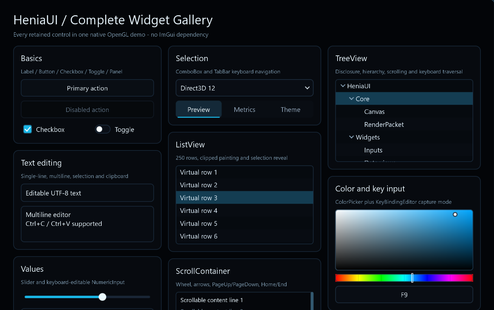
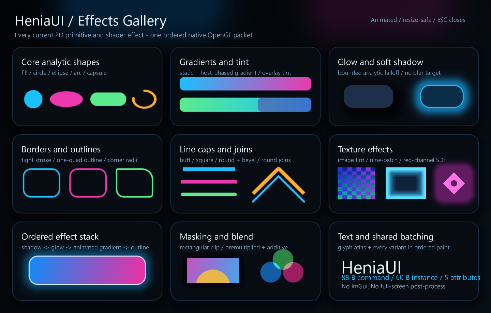
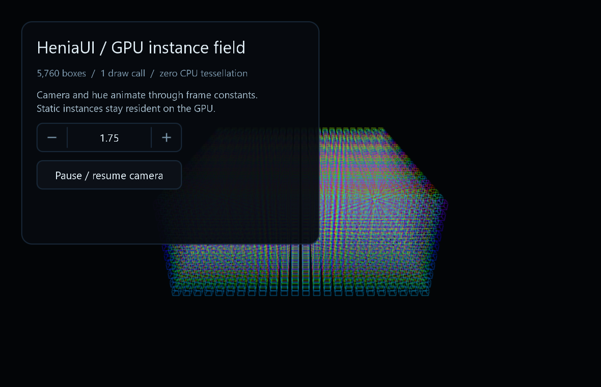

# HeniaUI

<p align="center">
  <strong>Retained UI and GPU-instanced rendering for native C++23 applications.</strong>
</p>

<p align="center">
  Backend-neutral · host-owned · allocation-aware · independent from ImGui
</p>

<p align="center">
  <a href="https://github.com/Caritusy/HeniaUI/actions/workflows/ci.yml"></a>
  <a href="LICENSE"></a>
  
</p>

<p align="center">
  <a href="#the-pitch">The Pitch</a> ·
  <a href="#demo">Demo</a> ·
  <a href="#getting-started">Getting Started</a> ·
  <a href="#integration">Integration</a> ·
  <a href="#how-it-works">How It Works</a> ·
  <a href="#documentation">Documentation</a>
</p>

<p align="center">
  
</p>

HeniaUI is a compact, standalone library for building native retained user
interfaces and high-volume 3D overlays. A retained widget tree or low-level
display list is compiled into immutable render packets, then submitted through
host-integrated OpenGL 3.3 or Direct3D 12 backends.

The library does not own your window, graphics context, swap chain, back buffer,
command queue, or application loop. It does not hook a host process, require
RTTI, or depend on ImGui. The platform-neutral core has no external dependency
beyond the C++ standard library.

> **Project status:** HeniaUI is currently pre-1.0 (`0.1.0`). The foundation is
> usable and continuously tested, but public APIs may still evolve.

## The Pitch

HeniaUI is designed for native tools, editors, launchers, overlays, real-time
visualization, and engine-integrated interfaces where ownership and frame costs
must remain explicit.

- **Retained where it matters.** Stable widget subtrees reuse layout, paint
  segments, compiled instances, and backend uploads until a real dirty reason
  appears.
- **One ordered UI stream.** Shapes, images, effects, SDF icons, nine-patches,
  and glyphs preserve paint order while compatible work shares draw batches.
- **Immutable publication.** `RenderPacket` and `InstanceBatch` are cheap,
  shareable snapshot handles with observable identities and revisions.
- **Host-owned integration.** Renderers consume an existing OpenGL context or
  D3D12 command list. They do not hide windows, queues, waits, or presentation.
- **Predictable frame paths.** Fixed-capacity modes, bounded diagnostics,
  fence-owned upload slots, dirty ranges, and explicit fallback counters make
  performance behavior testable.
- **Separate 2D and 3D fast paths.** Retained UI and generic GPU-instanced boxes
  share a host frame without being forced into one vertex format.
- **Production input.** Keyboard focus, pointer capture, scrolling, clipboard,
  IME composition, UTF-8 editing, and Per-Monitor V2 DPI integration are part of
  the public model.

HeniaUI is not an immediate-mode API and is not an ImGui wrapper. Its goal is a
small retained system that can be embedded without surrendering host ownership
or rebuilding stable content every frame.

## Demo

### Complete Widget Gallery

`HeniaUIWidgetGallery` is the equivalent of a full widget demo window. It shows
every built-in retained control in one native OpenGL application, including
text and numeric editing, lists, trees, scrolling, selection, color editing,
key capture, tooltips, and modal popups.

```powershell
cmake --preset vs2022
cmake --build --preset release --parallel
.\out\build\vs2022\Release\HeniaUIWidgetGallery.exe
```

Use the mouse wheel to inspect the full page and press `Escape` to close it.
For unattended visual verification, pass `--headless --snapshot`; the program
writes `HeniaUIWidgetGallery.bmp` in the current directory.

### Effects Gallery

<p align="center">
  
</p>

`HeniaUIEffectsExample` demonstrates the current analytic 2D primitives,
gradients, tinting, glow, soft shadows, borders, line caps and joins,
nine-patches, masking, blending, SDF icons, text, and ordered effect layers.

```powershell
.\out\build\vs2022\Release\HeniaUIEffectsExample.exe
```

### GPU Instance Field

<p align="center">
  
</p>

`HeniaUIVisualSandbox` combines retained controls with 5,760 animated 3D boxes
submitted in one instanced draw. Camera and hue animation change frame constants
while the immutable box snapshot remains resident on the GPU.

```powershell
.\out\build\vs2022\Release\HeniaUIVisualSandbox.exe
```

The repository also builds:

- `HeniaUISandbox`: portable CPU-side recording, batching, and statistics smoke
  test used by CI;
- `HeniaUIBenchmarks`: reproducible producer and backend performance scenes;
- `HeniaUID3D12InstanceBenchmarks`: timestamped upload-heap versus GPU-local
  instance storage comparison on Windows adapters.

## Getting Started

### Requirements

| Requirement | Notes |
| --- | --- |
| CMake | 3.24 or newer |
| Language | C++23, RTTI not required |
| Core and Gfx | Platform-neutral; continuously built on Windows and Linux |
| Win32 adapters | Windows SDK, DirectWrite, GDI, IMM32, and User32 |
| OpenGL backend | Windows host with an already-current compatible OpenGL 3.3 context |
| D3D12 backend | Windows host with a D3D12 device and host-owned command submission |

### Build and test on Windows

The checked-in Visual Studio 2022 preset builds the libraries, tests, examples,
and benchmarks:

```powershell
cmake --preset vs2022
cmake --build --preset dev --parallel
ctest --preset dev

cmake --build --preset release --parallel
ctest --preset release
```

Run the portable batching smoke test with:

```powershell
.\out\build\vs2022\Release\HeniaUISandbox.exe
```

For a minimal single-configuration build:

```bash
cmake -S . -B out/build/release \
  -DCMAKE_BUILD_TYPE=Release \
  -DHENIAUI_BUILD_TESTS=OFF \
  -DHENIAUI_BUILD_SANDBOX=OFF
cmake --build out/build/release --parallel
```

## Integration

### `add_subdirectory`

HeniaUI exports narrow CMake targets so consumers link only the layers they
need:

```cmake
add_subdirectory(external/HeniaUI)

target_link_libraries(MyApplication PRIVATE
    HeniaUI::Core
    HeniaUI::Win32
    HeniaUI::OpenGL
)
```

When HeniaUI is included as a subproject, tests and sandboxes default to off.

### Installed package

```powershell
cmake --install out\build\vs2022 --config Release --prefix out\install
```

```cmake
find_package(HeniaUI CONFIG REQUIRED)

target_link_libraries(MyApplication PRIVATE
    HeniaUI::Core
    HeniaUI::Gfx
    HeniaUI::Win32
    HeniaUI::OpenGL
    HeniaUI::D3D12
)
```

### CMake targets

| Target | Responsibility | Availability |
| --- | --- | --- |
| `HeniaUI::Core` | Retained 2D UI, display lists, text, textures, widgets | All platforms |
| `HeniaUI::Gfx` | Generic 3D instance data, visibility, shape batches | All platforms |
| `HeniaUI::Win32` | Font loading, clipboard, input, capture, and IME adapter | Windows |
| `HeniaUI::OpenGL` | 2D renderer and 3D render device | Windows |
| `HeniaUI::D3D12` | 2D renderer and 3D render device | Windows |

### CMake options

| Option | Default | Purpose |
| --- | --- | --- |
| `HENIAUI_BUILD_TESTS` | On for top-level builds | Build the automated test suite |
| `HENIAUI_BUILD_SANDBOX` | On for top-level builds | Build portable and Win32 examples |
| `HENIAUI_BUILD_BENCHMARKS` | Follows tests | Build reproducible benchmarks |
| `HENIAUI_ENABLE_ADDRESS_SANITIZER` | Off | Enable supported ASan instrumentation |
| `HENIAUI_ENABLE_UNDEFINED_SANITIZER` | Off | Enable Clang/GCC UBSan instrumentation |
| `HENIAUI_D3D12_RUNTIME_SHADER_COMPILATION` | Off | Allow Debug-only runtime HLSL recompilation |

## Usage

HeniaUI exposes two producer APIs that publish the same backend-neutral packet
model.

### Retained widgets

```cpp
#include <henia/ui/widget/Callback.h>
#include <henia/ui/widget/controls/Button.h>
#include <henia/ui/widget/controls/Label.h>
#include <henia/ui/widget/controls/Panel.h>

struct Actions {
    void save();
};

Actions actions;
auto root = std::make_unique<henia::ui::Panel>();
root->emplaceChild<henia::ui::Label>("Project settings");

auto& save = root->emplaceChild<henia::ui::Button>("Save");
save.setOnClick(
    henia::ui::Callback<>::bind<Actions, &Actions::save>(actions));

document.setRoot(std::move(root));
renderer.render(document.compose(), document.coordinateSpace().render);
```

`UiDocument` keeps independently revisioned layout and paint state per widget.
A dirty leaf rebuilds only its affected branch; stable siblings remain cached in
depth-first paint order.

Built-in controls include:

`Panel`, `Label`, `Button`, `NumericInput`, `TextInput`, `Checkbox`, `Toggle`,
`Slider`, `ComboBox`, `TabBar`, `ScrollContainer`, `ListView`, `TreeView`,
`Tooltip`, `PopupLayer`, `ColorPicker`, and `KeyBindingEditor`.

### Low-level canvas

```cpp
#include <henia/ui/Frame.h>

henia::ui::Frame frame;
frame.reserve(4096, 32, henia::ui::CapacityPolicy::Fixed);

auto& canvas = frame.begin();
canvas.fillRect(
    {{20.0F, 20.0F}, {420.0F, 240.0F}},
    {0.03F, 0.05F, 0.08F, 1.0F},
    12.0F);
canvas.line(
    {40.0F, 80.0F},
    {300.0F, 180.0F},
    {0.20F, 0.70F, 0.95F, 1.0F},
    2.0F,
    henia::ui::LineCap::Round);

henia::ui::RenderPacket packet = frame.finish();
```

`Frame::reserve` prewarms reusable immutable snapshot slots. Fixed-capacity
recording rejects overflow without allocating or publishing a partial packet;
grow mode retains expanded storage for later frames.

## How It Works

```text
Retained widget tree ─┐
                      ├─> display-list segments ─> BatchCompiler ─> RenderPacket
Low-level Canvas ─────┘                                      │
                                                             ├─> OpenGL UI renderer
                                                             └─> D3D12 UI renderer

ShapeBatch3D ─> immutable InstanceBatch ─> visibility policy ─┬─> OpenGL render device
                                                              └─> D3D12 render device
```

### 2D rendering

- Command ordering and nested clip intersections are preserved.
- Adjacent compatible instances share a draw batch; each batch carries a table
  of up to eight live textures.
- Rectangles, circles, ellipses, arcs, capsules, gradients, rounded shadows,
  independent-corner borders, lines, images, glyphs, nine-patches, SDF icons,
  and ordered effects use compact analytic instances.
- OpenGL and D3D12 consume the same `RenderPacket` and explicit
  `UiRenderViewport` coordinate transform.
- UI colors are straight-alpha linear values. Texture alpha and transfer
  semantics, plus linear versus sRGB render targets, are explicit metadata.

### Text and input

The dependency-free text path performs strict UTF-8 lookup, kerning, fallback
font selection, bounded layout/render caching, caret hit testing, selection,
and editing. Hosts that need Arabic, Indic, bidirectional, or other complex
shaping can implement `TextShapingBackend` without adding that dependency to
minimal builds.

`TextEditorState` keeps committed UTF-8 separate from IME preedit text and
supports codepoint-safe navigation, clipboard operations, and bounded undo/redo.
The Win32 adapter translates an existing host `WndProc` stream; it never
subclasses or owns the window.

### Asynchronous multilingual fonts

`Win32AsyncFontSet` supplies on-demand English, Simplified and Traditional
Chinese, Japanese, Korean, symbols, and monochrome emoji fallback faces. A
private DirectWrite worker rasterizes requested Unicode scalars into owned
Alpha8 bitmaps. It never touches `FontStore`, `TextureStore`, a renderer, or a
widget document. The owner thread publishes only a bounded number of completed
results per frame.

```cpp
#include <henia/ui/platform/win32/Win32AsyncFont.h>

henia::ui::Win32AsyncFontSet multilingual(textures, fontStore, {
    .primaryFont = primaryFont,
    .logicalPixelHeight = 18.0F,
    .dpiScale = dpi / 96.0F,
    .preallocatedPagesPerFace = 1,
});

textPainter.setFallbackFonts(multilingual.fontChain(
    henia::ui::Win32FontLocale::SimplifiedChinese));
textPainter.setGlyphRequestBackend(&multilingual);
textPainter.setFontRasterResolver(&multilingual);
multilingual.prewarmTextSizes({13.0F, 14.0F, 16.0F, 18.0F, 22.0F});

// Interactive frame: publish, upload, invalidate, then compose.
if (multilingual.commitReady(32) != 0) {
    if (!renderer.synchronizeTextures(textures)) {
        return false;
    }
    document.invalidateTypography();
}
renderer.render(document.compose(), document.coordinateSpace().render);
```

All `TextPainter`-driven controls automatically enqueue their UTF-8 text. The
queues are bounded, requests are deduplicated per face/physical-size/codepoint,
and retryable failures use bounded exponential backoff, so layout never waits
for rasterization. `fontChain()` selects locale-specific CJK face order and a
missing scalar advances through that chain instead of being broadcast to every
CJK face. The raster resolver chooses a bounded integer physical-size variant;
call `setDpiScale()` on monitor changes and prewarm known control sizes to avoid
first-use atlas work. `releaseResources()` stops the worker and explicitly
retires every internally owned face, glyph, and atlas page.

This scalar fallback path covers Latin, CJK, kana, Hangul, common symbols, and
many other characters available in the configured system faces. Color emoji is
currently flattened to the library's Alpha8 text contract. Arabic, Indic,
bidirectional text, ligatures, and emoji sequences still require an appropriate
`TextShapingBackend`; the simple shaper does not claim full Unicode shaping.

### GPU-instanced 3D shapes

```cpp
henia::gfx::ShapeBatch3D shapes;
shapes.replaceBoxes(boxes);       // only when object content changes
auto snapshot = shapes.snapshot();

henia::gfx::ViewParameters view{
    .viewProjection = cameraMatrix,
    .viewport = {width, height},
    .timeSeconds = time,
};

renderDevice.render(snapshot, view, hasDepthAttachment);
```

Each box stores bounds, color, pixel line width, hue offset, and generic effect
parameters. The GPU expands twelve fixed edges into indexed four-vertex quads. Camera and
time changes update frame constants without rebuilding or re-uploading stable
instance content. Optional visibility reuses immutable page bounds and keeps
direct submission as the default path.

### Host ownership

HeniaUI owns its CPU-side trees, immutable packets, renderer resources, and
preallocated upload bookkeeping. The host owns application lifecycle and all
presentation infrastructure.

- OpenGL calls require the initialization context to be current. The default
  `Preserve` policy restores changed pipeline state; opt-in `DedicatedContext`
  establishes HeniaUI state without the capture/restore walk. Instance uploads
  are transient by default, with an opt-in persistently mapped strategy on
  OpenGL 4.4/`ARB_buffer_storage`. Neither strategy waits for an upload slot.
- D3D12 records into a host-owned direct command list. The host binds targets,
  performs resource transitions, submits work, and associates submission slots
  with fences.
- Missing depth attachments select an explicit depth-disabled fallback and
  increment diagnostics instead of pretending depth testing occurred.

## Quality and Testing

The complete local validation matrix is:

```powershell
cmake --preset vs2022
cmake --build --preset dev --parallel
ctest --preset dev
cmake --build --preset release --parallel
ctest --preset release
.\out\build\vs2022\Release\HeniaUISandbox.exe
```

GitHub Actions additionally covers Windows Debug and Release, Linux Release,
Clang and MSVC AddressSanitizer builds, Clang undefined-behavior checks, D3D12
debug-layer/GPU-validation/DRED execution, shader reproducibility, installed
package consumption, OpenGL output validation, and benchmark regression gates.

Performance statistics distinguish producer build time, instance uploads, CPU
submission/recording, draw counts, fallbacks, and optional host-resolved GPU
timestamps. See the benchmark methodology before comparing machines or runners.

## Documentation

| Guide | Contents |
| --- | --- |
| [Architecture](docs/architecture.md) | Retained composition, immutable publication, threading, input, renderer ownership |
| [Coordinate spaces and DPI](docs/coordinate-spaces.md) | Logical input, layout units, framebuffer transforms, Per-Monitor V2 integration |
| [Color and texture contract](docs/color-and-texture-contract.md) | Alpha modes, linear/sRGB transfer, texture synchronization |
| [D3D12 integration](docs/d3d12-integration.md) | Command-list state, shader packages, descriptors, pipeline libraries |
| [Resource lifetime](docs/resource-lifetime.md) | Context/device recreation, shutdown, abandon, fence ownership |
| [3D visibility](docs/3d-visibility.md) | Frustum/mask/size filtering and D3D12 indirect submission |
| [Benchmarks](docs/benchmarks.md) | Fixed scenes, metrics, baselines, and regression policy |

## Support and Contributions

Use [GitHub Issues](https://github.com/Caritusy/HeniaUI/issues) for bug reports,
feature requests, and roadmap discussion. Reproductions should identify the
backend, build configuration, host ownership boundary, and the smallest input
or render packet that demonstrates the problem.

Changes should preserve the standalone CMake package, backend-neutral public
semantics, immutable packet contracts, host ownership, and warning-clean C++23
builds. Behavior and performance contracts should be covered by focused tests.

## License

HeniaUI is available under the [MIT License](LICENSE).
